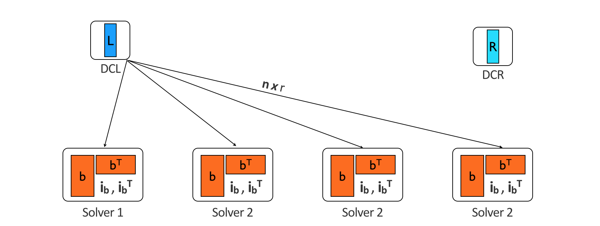
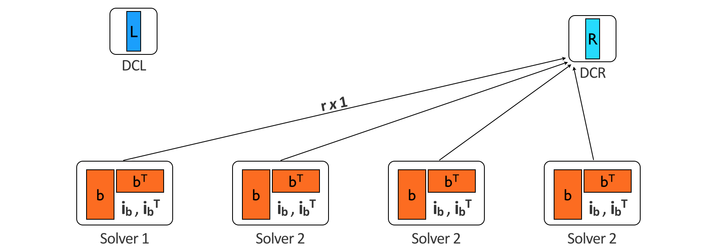

# Residual Constrained Alternating Minimization (RCAM)

The package includes two highly parallel and scalable distribution schemes for RCAM algorithms. Since the solves for every row of the factors are independant, and they rely on only a column of the data and the data transpose, the frameworks distribute the data across all available workers and apply the supplied solve function to each column of the data. These row updates are performed asynchronuously for a factor, but since factors updates are not independant the frameworks will wait for all rows of L to return before dispatching the work for R, and vice-versa.

Both frameworks duplicate the data by distributing the columns of the data, and the data transpose. This prevents any communication of the data amongst the workers, and the performance benefits outweigh the obvious downside of duplicating the data. The data is distributed as a DistributedArray, and work is distributed by spawning tasks on each worker that will make use of the localpart of the distributed data and communicate row updates to a common host.

---
## DCLR Framework
**D**edicated **C**ommunicators for **L** and **R** Factors

The DCLR framework dedicates 2 workers to act as servers for the L and R factors and handle all communcations associated with row updates. For example, during a L solve the server for R distributes the updated R factor to all workers.

Which all workers combine with their local data to return L factor row updates to the server for L. Isolating the all-to-one and one-to-all communications to these two hosts reduces blocking communication.

---
## Redis

The Redis framework replaces the 2 dedicated communicators with a Redis server that stores the rows of L and R. In order to store this numerical data on the Redis server, the data is encoded from binary data to text. Right now the binary data is converted to hex, which is a very quick operation but doubles the size of each vector. The Redis server can handle much more throughput than the dedicated commnicators, so it offers performance benefits at scale. 

---
## Future Work

* Cache local updates to reduce network round trips, should do this ASAP
* Smartly store the data so that there is no duplication on each worker. For example, make use of the fact that the first element of **b**1 is also the first element of **b**1T. Because we are storing multiple columns of both **b** and **b**T on each worker, there is a region of overlap.
